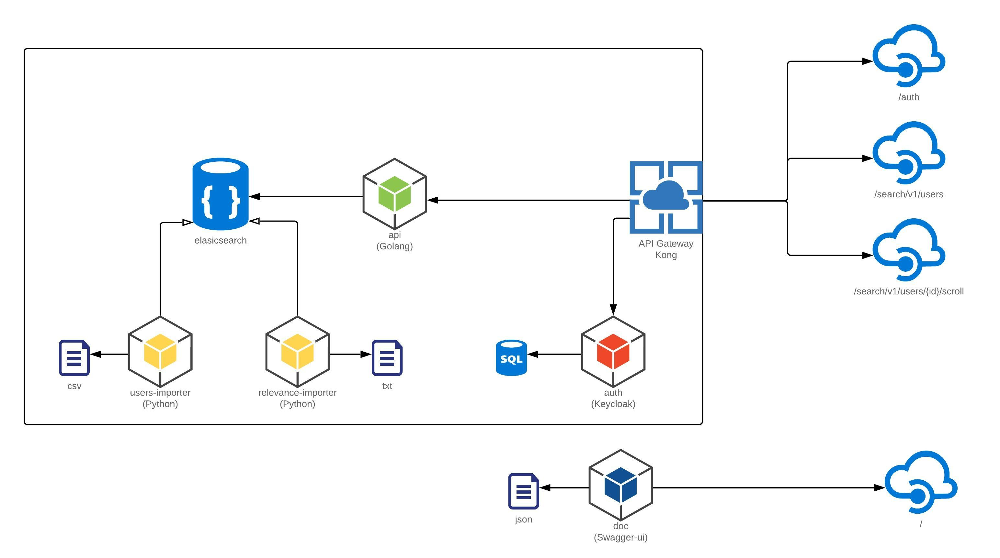

# text-search

------

A solução consiste em três partes: leitura, escrita e infraestrutura, onde a aplicação `api` é responsável por disponibilizar recursos de busca de usuários através de APIs Rest com base nos dados persistidos no Elasticsearch, a ingestão dos dados no Elasticsearch são realizadas através de arquivos csv e txt que são processados pelas aplicações `users-importer` e `relevance-importer`, as quais fazem o parser dos arquivos e enviam para o Elasticsearch e camada de infraestrutura é composta pelos módulos `auth`, `gateway` e `doc`, que são responsáveis pela exposição e autenticação dos recursos de buscas, como demonstrado na imagem abaixo.  




### Pré requisitos
- Docker (18.02.0+) 

### Setup

Execute o script abaixo para iniciar a configuração de infraestrura, configurando uma network para isolamento das aplicações.
```
./scripts/start-infra.sh
```

Execute o docker compose com o comando abaixo para inicializar o Elasticsearch, a aplicação `api` e os módulos de infraestrutura.
```
docker-compose up
```

Aguarde pela inicialização do Elasticsearch.

Observação: O recurso de health `curl -GET http://localhost:8080/health/ready` pode ser utilizado para acompanhar se a aplicação faz conexão com o Elasticsearch. 

Execute o script `importers-build-images.sh` para realizar o build das imagens (`user-importer` e `relavance-import`) que fazem a importação dos dados no Elasticsearch.
```
./scripts/importers-build-images.sh
```

Execute o docker abaixo para realizar a carga de usuário.
```
docker run -it \
    --name userimport \
    --network=textsearch \
    --link elasticsearch \
    -e ELASTIC_HOST="elasticsearch" \
    -e ELASTIC_INDEX="users" \
    -e FILE_CHUNK_SIZE=10000 \
    -e FILE_NAME="/tmp/users.csv.gz" \
    -v `pwd`/user-importer/users.csv.gz:/tmp/users.csv.gz \
   textsearch/userimport
```
Observação: essa operação pode levar alguns minutos devido o tamanho do arquivo csv

Execute o docker abaixo para realizar o preenchimento da relevância dos usuário.
```
docker run -it \
    --name relevanceimport \
    --network=textsearch \
    --link elasticsearch \
    -e ELASTIC_HOST="elasticsearch" \
    -e ELASTIC_INDEX="users" \
    -e FILES="/tmp/relevance_1.txt:99,/tmp/relevance_2.txt:50" \
    -v `pwd`/relevance-importer/relevance_1.txt:/tmp/relevance_1.txt \
    -v `pwd`/relevance-importer/relevance_2.txt:/tmp/relevance_2.txt \
   textsearch/relevanceimport
```

### Uso da solução

Após execução dos passos do setup, dois recursos são disponibilizados para consulta de usuários e um recurso para obter o token de acesso, são eles: 

O primeiro passo a ser realizado é a obtenção do token para acessos nos recursos de buscas, o qual é obrigatório nas requisições. O recurso deve ser requisitado com as credenciais:`api@gmail.com.br` e `api`, seguindo o seguinte exemplo: 
```
curl -s -X POST \
-d "username=api@gmail.com.br" \
-d "password=api" \
http://localhost:8000/auth)
```

Com o resultado da requisição anterior, o atributo `access_token` da resposta precisa ser passado no header das requisições no formato `Authorization: Bearer <access_token>`, com isso, o acesso ao recurso de busca de usuário pode ser utilizado. O recurso de busca possibilita a busca por um termo que deve ser informado no parâmetro `search`, o qual retorna um conjunto de até 15 usuários de acordo com o critério pesquisado. 
```
curl -H "Authorization: Bearer ${ACCESS_TOKEN}" \ 
http://localhost:8000/search/v1/users?search=Diether
```

No retorno do recurso de busca também é retornado o atributo `scrollId`, que permite a consulta de novos resultados com o mesmo critério sem a necessidade de novas passagens de parâmetros, utilizando o recurso seguinte de paginação por "scroll".
```
curl -H "Authorization: Bearer ${ACCESS_TOKEN}" \
http://localhost:8000/search/v1/users/{scrollId}/scroll
```

Informações mais detalhadas estão disponíveis na documentação do Swagger disponível no endereço abaixo. 
```
http://localhost/
```

Cada projeto possui seu readme com informações específicas dos projetos.
- [api](./api/README.md)
- [user-importer](./user-importer/README.md)
- [relevance-importer](./relevance-importer/README.md)
- [auth](./auth/README.md)
- [gateway](./gateway/README.md)
- [doc](./doc/README.md)
